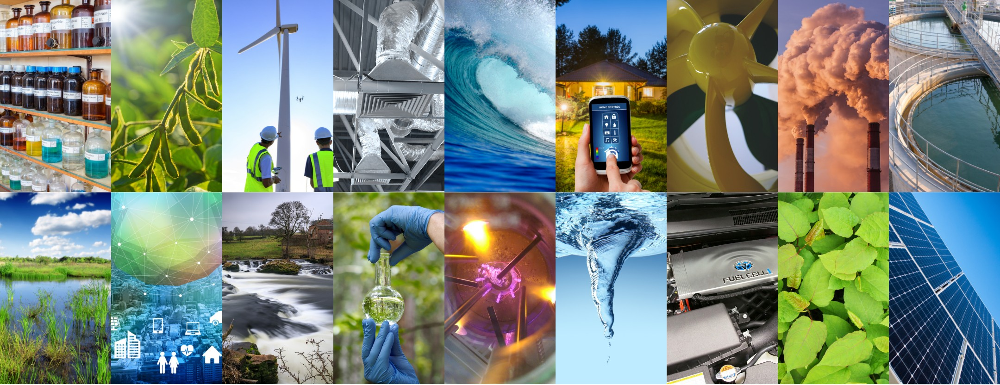

 

# GlobalEco Insights

#### The goal of this project is to provide actionable insights into the effects of climate change by identifying trends and correlations within the dataset. These insights can support policy decisions, promote sustainable practices, and increase public awareness of climate-related issues.

## Overview 
This dataset contains temperature and climate-related data for various countries over multiple years. It includes information on temperature, CO2 emissions, sea level rise, rainfall, population, renewable energy usage, extreme weather events, and forest area.

## Dataset Content -

Filename: temperature.csv
Rows: 1000
Columns: 10

#### Column Descriptions

* Year (int) - The year of the recorded data.
* Country (string) - The name of the country.
* Avg_Temperature_degC (float) - The average annual temperature in degrees Celsius.
* CO2_Emissions_tons_per_capita (float) - CO2 emissions in tons per capita.
* Sea_Level_Rise_mm (float) - Sea level rise in millimeters.
* Rainfall_mm (int) - Total annual rainfall in millimeters.
* Population (int)- The population of the country.
* Renewable_Energy_pct (float) - Percentage of total energy consumption from renewable sources.
* Extreme_Weather_Events (int) - Number of recorded extreme weather events.
* Forest_Area_pct (float) - Percentage of land area covered by forests.

## Business Requirements -

* Identify trends and correlations between variables (e.g., temperature vs. CO2 emissions, sea level rise vs. extreme weather events).
* Perform time-series analysis to observe changes over time.
* Conduct geospatial analysis to compare data across different countries.
* Create interactive dashboards and visualizations to present insights.
* Develop a user-friendly interface for stakeholders to explore data and insights.
* Ensure accessibility and ease of use for non-technical users.

## Hypothesis and Validations -

### Hypothesis 1 : Average temperature has increased over the years
  ##### Validation - Perform a trend analysis using linear regression or time series analysis on the Avg_Temperature_degC column across different years. Visualise the trend using line charts to observe any significant increase over time.

### Hypothesis 2 : Countries with a higher percentage of renewable energy have lower CO2 emissions.
   ##### Validation - Conduct a correlation analysis between Renewable_Energy_pct and CO2_Emissions_tons_per_capita. A negative correlation would support the hypothesis. Additionally, scatter plots and regression models can further confirm the relationship.

### Hypothesis 3 : A decrease in forest area percentage leads to an increase in extreme weather events.
  ##### Validation - Perform a comparative analysis using Forest_Area_pct and Extreme_Weather_Events data. Use correlation analysis and visualize the results using scatter plots. A significant negative correlation would support this hypothesis.

### Hypothesis 4 : Higher population growth contributes to increased CO2 emissions and rising sea levels.
  ##### Validation - Analyse the relationship between Population, CO2_Emissions_tons_per_capita, and Sea_Level_Rise_mm using multiple regression analysis. Evaluate the strength of the relationships through coefficients and significance levels.

## Project Plan
#### Step 1: Data Collection
 * Collect temperature and climate-related data from reliable sources for educational studies like Kaggle source.
 * Ensure the data covers a diverse set of countries over multiple years for comprehensive analysis.

#### Step 2: Data Cleaning
 * Perform data cleaning to handle missing values, outliers, or inconsistent data.
 * Standardise data formats and convert units if necessary.
 * Store the cleaned data in a structured format using CSV or database systems for easy access.

#### Step 3: Data Analysis
 * Conduct exploratory data analysis (EDA) to identify trends, patterns, and correlations.
 * Apply statistical analysis, including linear regression, correlation analysis, and hypothesis testing.
 * Create visualisations using libraries like Matplotlib,Plotly or Seaborn to enhance interpretation.

#### Step 4: Interpretation and Insights
 * Evaluate the analysis results to confirm or refute the proposed hypotheses.
 * Identify actionable insights and trends in temperature changes, CO2 emissions, renewable energy impact, and forest area changes.

#### Step 5: Visualisation and Documentation
 * Document findings using visual reports, Tableau dashboards and presentations.
 * Provide recommendations based on the analysis to inform policy decisions and sustainable practices.

### Research Methodology
 * Trend Analysis: Used to identify long-term temperature changes over the years.
 * Correlation Analysis: Applied to measure the strength and direction of relationships between variables such as renewable energy usage and CO2 emissions.
 * Regression Models: Implemented to predict outcomes based on independent variables like population growth and CO2 emissions.
 * Comparative Analysis: Used to evaluate how forest area percentage influences extreme weather events.

## The rationale to map the business requirements to the Data Visualisations
| Business Requirement | Rationale  | Visualisations|
| :-------------: |:-------------:| :-----:|
| Identify temperature trends over the years| Line charts and time series plots can visually represent temperature changes, making it easier to observe patterns and trends.| Line Chart, Time Series Plot |
| Assess the impact of renewable energy on CO2 emissions |Scatter plots and regression analysis visualisations can illustrate the correlation between renewable energy adoption and CO2 emissions, showing the effectiveness of renewable energy policies. | Scatter Plot, Regression Plot |
| Analyse the effect of forest area reduction on extreme weather events | Comparative bar charts or scatter plots can be used to show the relationship between forest area percentages and extreme weather events.|	Bar Chart, Scatter Plot |
| Evaluate population growth's impact on CO2 emissions and sea level rise |	Regression analysis visuals, and heatmaps can provide insights into how population growth contributes to CO2 emissions and rising sea levels. | Regression Plot, Heatmap |
| Create interactive dashboards for stakeholders |	Dashboards with interactive charts and filters enable stakeholders to explore insights easily.|	Tableau Dashboard, Filterable Visualisations

## Analysis Techniques used -

#### Data Analysis Techniques and Limitations
* Trend Analysis: Applied for temperature change detection using time series data.
    * Limitation: Seasonal variations might obscure long-term trends.
* Correlation Analysis: Used to measure relationships between variables like CO2 emissions and renewable energy adoption.  
    * Limitation: Correlation doesn't imply causation.
* Regression Analysis: Implemented to predict sea level rise and CO2 emissions based on population growth. 
    * Limitation: Multicollinearity can reduce the accuracy of predictions.
* Comparative Analysis: Used to examine how forest area reduction impacts extreme weather events.  
    * Limitation: Requires comprehensive data on regional weather patterns.

#### Use of Generative AI Tools

* Ideation: AI-assisted brainstorming was used to generate hypotheses and explore different perspectives.
* Design Thinking: Generative AI suggested effective visualization designs for clearer insights.
* Code Optimisation: AI helped in refactoring and optimizing complex analytical code, improving efficiency and clarity.

## Ethical considerations
* Were there any data privacy, bias or fairness issues with the data?
* How did you overcome any legal or societal issues?

## Dashboard Design

This Tableau dashboard titled "Global EcoInsights" provides an interactive visual representation of global climate data.
* Temperature Trend:-
  * Displays the average temperature change over time from 2000 to 2025.
  * The green line shows temperature fluctuations, and a red dashed line indicates a reference trend.
* Renewables vs CO₂ Emissions:-
  * A scatter plot visualising the relationship between the percentage of renewable energy used and CO₂ emissions.
  * Different countries are represented with various colors.
* Forest vs Weather Events:-
  * Shows how the forest area (percentage of land) is related to extreme weather events over time.
* Population vs CO₂ & Sea Level:-
  * A bubble chart depicting the correlation between population size, CO₂ emissions per capita, and sea level rise.
  * Bubble size and color represent different countries and their emission levels.
* Global Climate Map:-
  * A geographical visualisation using a world map, representing data related to temperature changes, emissions, or climate impact.
* Interactive Controls:-
  * Year Slider: Allows users to filter data for a specific year range.
  * Country Filter: Enables users to focus on specific countries.
  * Sea Level Rise Markers: Displays sea level rise measurements using selectable radio buttons.
  * Temperature Indicator: Provides a color-coded bar displaying average temperatures.

https://public.tableau.com/app/profile/mukti.mathapati/viz/GlobalEcoInsights_17425611140370/GlobalEcoInsightsReport?publish=yes

### Key Insights 
This dashboard effectively visualises the interconnections between population growth, CO₂ emissions, renewable energy adoption, forest cover, and climate impacts like temperature rise and sea level changes. It’s a valuable tool for decision-makers and environmental analysts to track and predict climate change impacts.

## Unfixed Bugs
* Please mention unfixed bugs and why they were not fixed. This section should include shortcomings of the frameworks or technologies used. Although time can be a significant variable to consider, paucity of time and difficulty understanding implementation are not valid reasons to leave bugs unfixed.
* Did you recognise gaps in your knowledge, and how did you address them?
* If applicable, include evidence of feedback received (from peers or instructors) and how it improved your approach or understanding.

## Development Roadmap
* What challenges did you face, and what strategies were used to overcome these challenges?
* What new skills or tools do you plan to learn next based on your project experience? 

## Main Data Analysis Libraries
* Here you should list the libraries you used in the project and provide an example(s) of how you used these libraries.

## Credits 

* In this section, you need to reference where you got your content, media and extra help from. It is common practice to use code from other repositories and tutorials, however, it is important to be very specific about these sources to avoid plagiarism. 
* You can break the credits section up into Content and Media, depending on what you have included in your project. 

### Content 

- The text for the Home page was taken from Wikipedia Article A
- Instructions on how to implement form validation on the Sign-Up page was taken from [Specific YouTube Tutorial](https://www.youtube.com/)
- The icons in the footer were taken from [Font Awesome](https://fontawesome.com/)

### Media

- The photos used on the home and sign-up page are from This Open-Source site
- The images used for the gallery page were taken from this other open-source site

# 

## Acknowledgements
* Thank the people who provided support through this project.